# K-Write-OCR

한국어 손글씨 OCR 모델을 바닥부터 만드는 프로젝트입니다. 이 프로젝트는 한국어 손글씨 인식을 위한 OCR 모델을 처음부터 구현하는 것을 목표로 하며, 데이터 전처리부터 모델 학습까지의 파이프라인을 제공합니다.


## 🔧 초기 세팅


[AI-Hub 대용량 손글씨 OCR 데이터](https://aihub.or.kr/aihubdata/data/view.do?dataSetSn=605) 다운로드. 자세한 사항은 [dataset_here.md](data/dataset_here.md)를 참고하세요.

## 📖 사용방법

### 🚀 시작하기

이 프로젝트는 [uv](https://docs.astral.sh/uv/)를 사용하여 의존성을 관리합니다.

```bash
# 프로젝트 실행
uv run main.py

# 도움말 보기
uv run main.py --help
```

---

### 🗂️ 데이터 폴더 변환

```bash
# 데이터 압축 해제
uv run main.py data unzip
un run main.py data unzip --help # arg 및 옵션 보기
uv run main.py data unzip --yes  # 확인 없이 진행

# 폴더 구조 정리
uv run main.py data compact
uv run main.py data compact --help # arg 및 옵션 보기
uv run main.py data compact --yes  # 확인 없이 진행

# 데이터와 라벨 동기화
uv run main.py data sync
uv run main.py data sync --help # arg 및 옵션 보기
uv run main.py data sync --yes  # 확인 없이 진행

# 데이터 수 줄이기
uv run main.py data drop --help # arg 및 옵션 보기
uv run main.py data drop 0.9  # 90% 데이터 삭제
uv run main.py data drop 0.9 --yes  # 확인 없이 진행

# 데이터셋 통계 정보 확인
uv run main.py data info
uv run main.py data info --help # arg 및 옵션 보기
```

**`unzip` - 데이터셋 압축 해제**

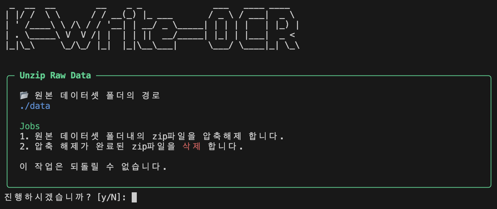

**`compact` - 폴더 구조 정리**

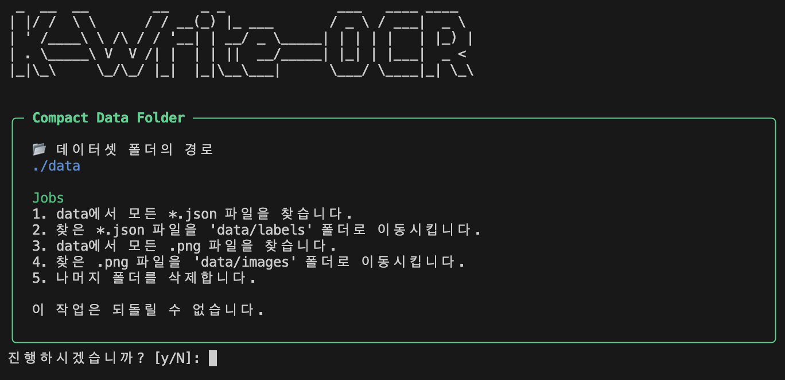

**`sync` - 데이터와 라벨 동기화**

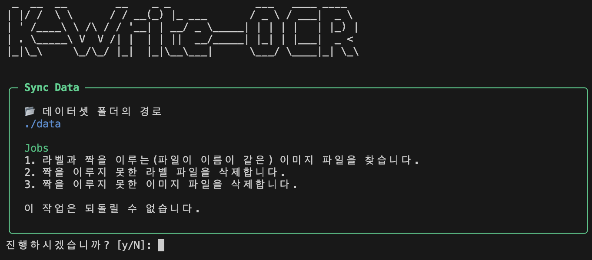

**`drop` - 데이터 수 줄이기**

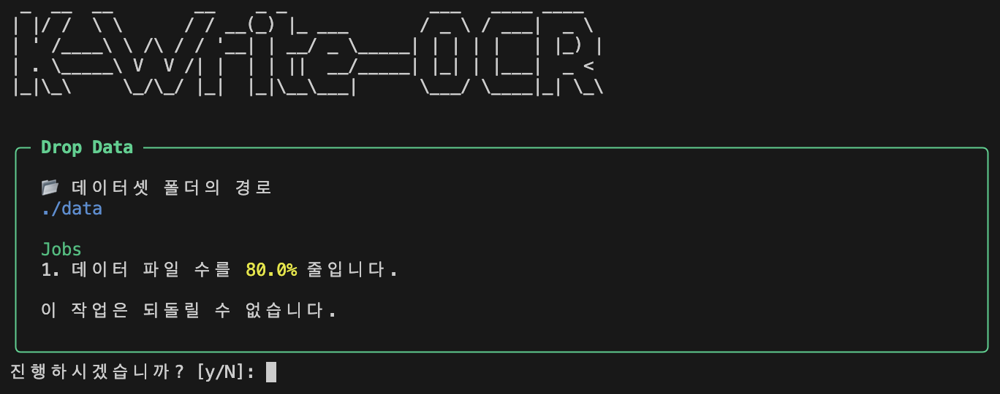

**`info` - 데이터셋 통계 정보**

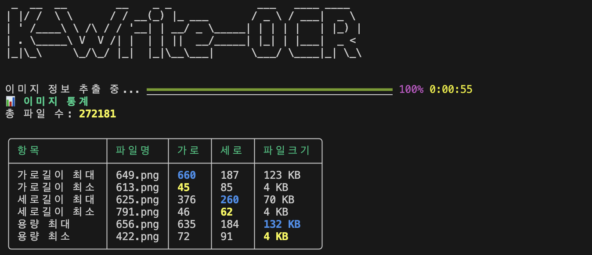

---

### 🏭 데이터 전처리

```bash
# 소스 이미지에서 학습용 이미지 추출
python main.py preprocess crop
python main.py preprocess crop --yes  # 확인 없이 진행

# 이미지 흑백 변환
python main.py preprocess gray
python main.py preprocess gray --threshold 128  # 임계값 지정
python main.py preprocess gray --yes  # 확인 없이 진행

# 이미지 크기 조정
python main.py preprocess resize 64 32  # 가로 64, 세로 32로 변경
python main.py preprocess resize 64 32 --algo lanczos  # 리사이즈 알고리즘 지정
python main.py preprocess resize 64 32 --yes  # 확인 없이 진행

# 한글 데이터만 필터링
python main.py preprocess filter:korean
python main.py preprocess filter:korean --yes  # 확인 없이 진행

# train/test 데이터셋 분리
python main.py preprocess split
python main.py preprocess split --train-ratio 0.8  # train 비율 지정
python main.py preprocess split --yes  # 확인 없이 진행

# 데이터 수 줄이기
python main.py preprocess drop 100  # 마지막 100개 데이터 삭제
python main.py preprocess drop 100 --yes  # 확인 없이 진행
```

**`crop` - 소스 이미지에서 학습용 이미지 추출**

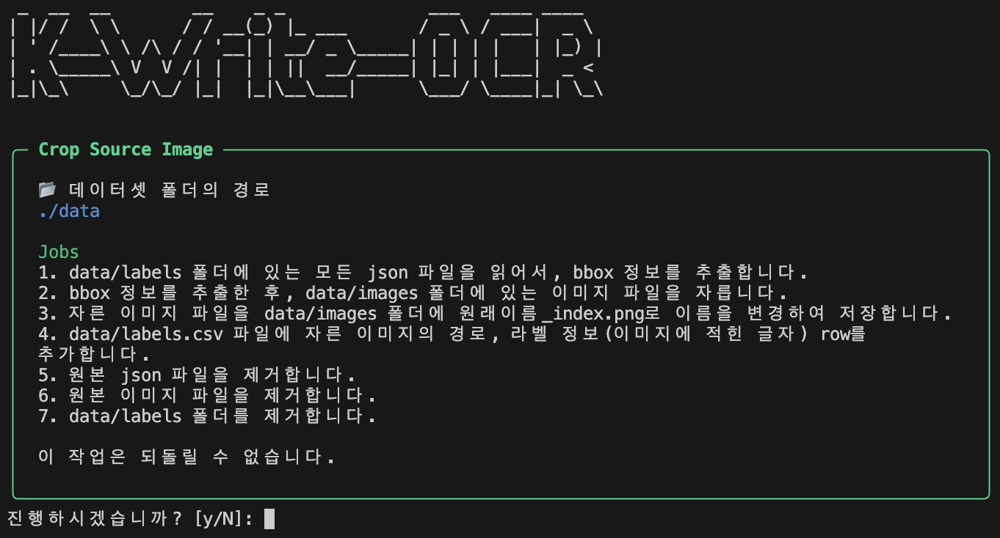

**`gray` - 이미지 흑백 변환**

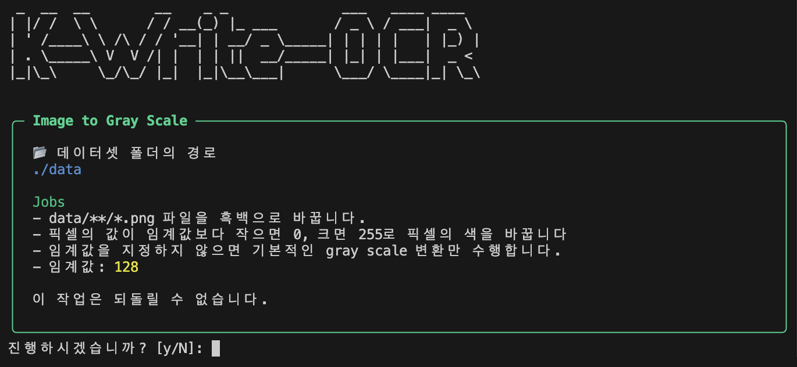

**`resize` - 이미지 크기 조정**

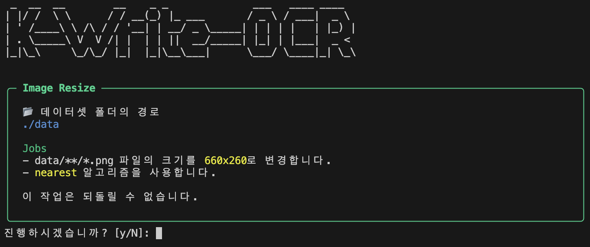

**`filter:korean` - 한글 데이터 필터링**

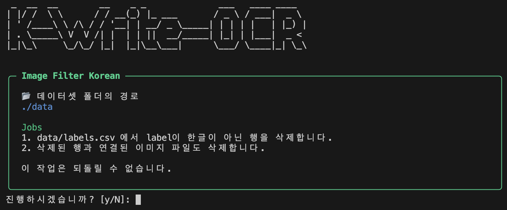

**`split` - train/test 데이터셋 분리**

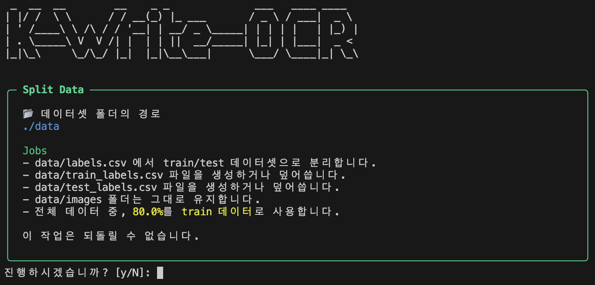

**`drop` - 데이터 수 줄이기**

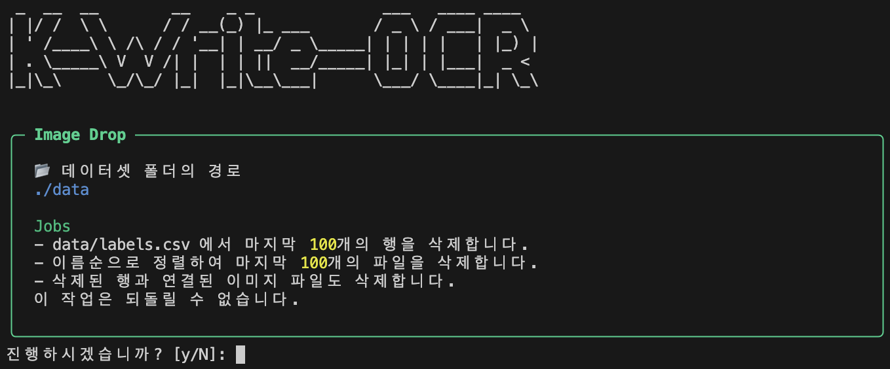

---

### 🧠 모델 학습

```bash
# 모델 학습 시작
python main.py train train
python main.py train train --max-epoch 50  # 최대 에폭 수 지정
python main.py train train --batch-size 64  # 배치 크기 지정
python main.py train train --patience 10  # Early stopping 인내 횟수
python main.py train train --debug  # 디버깅 모드
python main.py train train --yes  # 확인 없이 진행
```

전처리가 완료된 데이터를 사용하여 한국어 손글씨 인식 모델을 학습시킵니다. CNN 기반의 신경망을 사용하며, 자소 단위로 분해하여 학습합니다. Early stopping, 디버깅 모드 등 다양한 옵션을 제공하여 효율적인 학습이 가능합니다.

**주요 옵션:**

- `--max-epoch`: 학습할 최대 에폭 수 (기본값: 30)
- `--batch-size`: 배치 크기 (기본값: 32)
- `--patience`: Early stopping을 위한 인내 횟수
- `--debug`: 디버깅 모드 활성화 (상세한 로그 출력)
- `--yes`: 확인 없이 바로 학습 시작

## 기타 문서

- [기술적 결정과 비화](docs/story.md)
