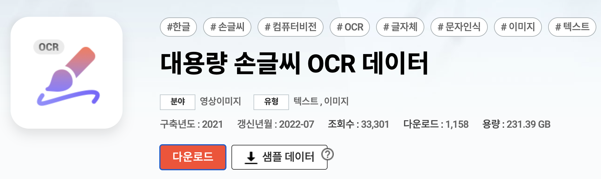
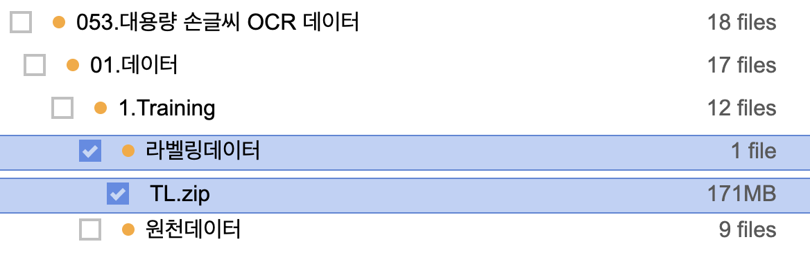
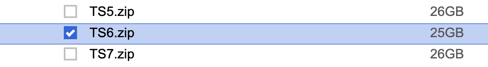

# 데이터셋을 다운받으세요.

[AI-Hub](https://aihub.or.kr/aihubdata/data/view.do?dataSetSn=605)에서 데이터를 이 폴더(data)에 다운받으세요.

용량을 고려하여 선택적으로 다운받습니다.

TL.zip은 모든 image 데이터에 대한 정답 label이 들어있으므로 반드시 다운받습니다.
용량을 고려하여 TS6.zip, TS7.zip, TS8.zip를 선택적으로 다운받습니다.
데이터의 양만 차이가 날 뿐 어떤 것을 다운받아도 상관없습니다.

이후의 진행은 [README.md](/README.md)의 내용을 따릅니다.
